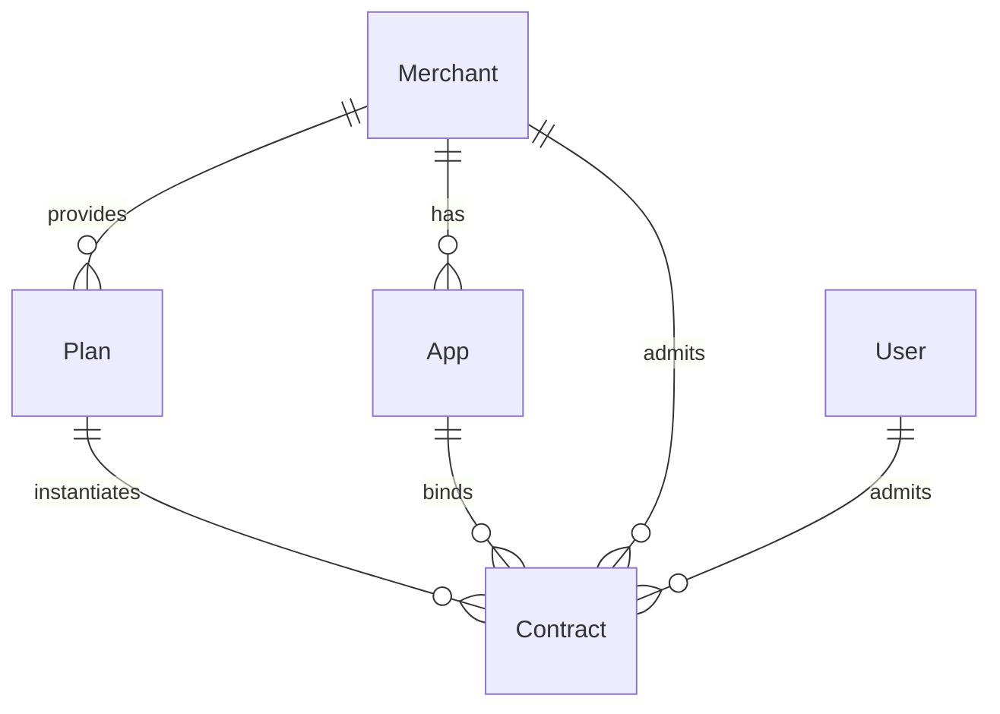
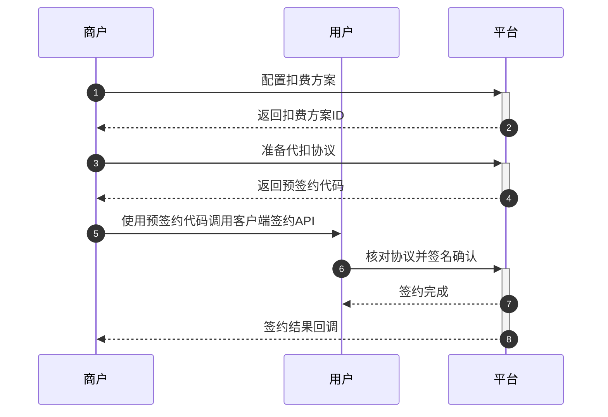

# 设计文档

[TOC]

## 需求

设计一个扣费服务管理的后台系统，需要具备功能：

- 查看扣费服务列表
- 开通扣费服务
- 关闭扣费服务

原型参考微信支付扣费服务。

## 模型设计

### 总体思路

将商户与用户对扣费服务的约定抽象为**代扣协议（Contract）**。

同一商户对不同用户提供的扣费服务通常具有相同的属性，为了方便审核/管理/风控，抽象出**代扣方案（Plan）**，包括扣费用途、扣费限额等。

商户需要先向平台报备**代扣方案**，经过审批后，基于代扣方案补充签约周期等属性派生**代扣协议**，与用户签约代扣协议。

协议过期、解约、吊销后即失效，商户可以凭有效代扣协议发起扣费。

### 关系拓扑



### 代扣方案

Demo未展开设计代扣方案模型，只要求必需属性：

| 属性名称  | 类型   | 描述         | 示例                         |
| --------- | ------ | ------------ | ---------------------------- |
| mch_id    | uint64 | 商户ID       | 10590                        |
| plan_id   | uint64 | 代扣方案ID   | 808                          |
| plan_name | string | 代扣方案名称 | 腾讯视频会员连续包月         |
| plan_desc | string | 代扣方案描述 | 每月自动续费腾讯视频会员业务 |

### 代扣协议

**商户**与**用户**按**代扣方案**完成签约，因此**代扣方案**需要关联**用户ID**、**商户ID**、**代扣方案ID**。

相同的商户、用户，针对同一个代扣方案只能有一个有效代扣协议，可以解约后再签，或同时签约不同代扣方案的协议。

签约通常在商户的一个应用发起（公众号、小程序、H5等），因此需要关联**签约来源应用ID**，方便统计、回调等。

加入代扣协议本身的属性后，完整属性如下：

| 属性名称       | 类型   | 描述       | 示例             |
| -------------- | ------ | ---------- | ---------------- |
| user_id | uint64 | 用户ID | 10086 |
| mch_id | uint64 | 商户ID | 10590 |
| app_id | uint64 | 签约来源应用ID | 707 |
| plan_id | uint64 | 代扣方案ID | 808 |
| contract_id    | uint64 | 代扣协议ID，自动生成，全局唯一 | 518060 |
| contract_code  | string | 商户侧生成的代扣协议号，同商户唯一 | RP20210809220243 |
| contract_state | enum   | 协议状态，详见下表 | Valid(1) |
| display_account | string | 开通账户名称，用于签约时展示 | QQ用户(10001) |
| signed_time | string | 协议签约时间，UMT+8 | 2021-08-09 22:17:05 |
| expired_time | string | 协议过期时间，UMT+8 | 2021-08-09 22:17:34 |
| terminated_time | string | 协议解除时间，UMT+8 | 2021-08-09 22:18:21 |

代扣协议状态枚举值：

| 值   | 名称               | 描述             |
| ---- | ------------------ | ---------------- |
| 0    | Pending            | 待签约/签约中    |
| 1    | Valid              | 有效签约         |
| 2    | Expired            | 签约过期         |
| 3    | Revoked            | 签约已被平台吊销 |
| 4    | UserTerminated     | 用户终止签约     |
| 5    | MerchantTerminated | 商户终止签约     |

Protobuf描述：

```protobuf
// 代扣协议
message ContractInfo {
  uint64 user_id = 1; // 用户ID
  uint64 mch_id = 2; // 商户ID
  string mch_name = 3; // 商户名称
  uint64 app_id = 4; // 应用ID
  string app_name = 5; // 应用名称
  uint64 contract_id = 6; // 协议ID
  string contract_code = 7; // 商户协议号
  ContractState contract_state = 8; // 协议状态
  uint64 plan_id = 9; // 代扣方案ID
  string plan_name = 10; // 代扣方案名称
  string plan_desc = 11; // 代扣方案描述
  string display_account = 12; // 开通账户名称
  string signed_time = 13; // 协议签署时间
  string expired_time = 14; // 协议到期时间
  string terminated_time = 15; // 协议解约时间
}

// 代扣协议状态
enum ContractState {
  Pending = 0; // 签约中
  Valid = 1; // 有效签约
  Expired = 2; // 签约过期
  Revoked = 3; // 已被吊销
  UserTerminated = 4; // 用户终止签约
  MerchantTerminated = 5; // 商户终止签约
}
```

### 用户、商户、应用

这三项模型不在扣费服务设计范围内，从简设计：

用户属性：

| 属性名称  | 类型   | 描述     | 示例    |
| --------- | ------ | -------- | ------- |
| user_id   | uint64 | 用户ID   | 10086   |
| user_name | string | 用户昵称 | Tencent |

商户属性：

| 属性名称 | 类型   | 描述     | 示例     |
| -------- | ------ | -------- | -------- |
| mch_id   | uint64 | 商户ID   | 10590    |
| mch_name | string | 商户名称 | 腾讯视频 |

应用属性：

| 属性名称 | 类型   | 描述     | 示例        |
| -------- | ------ | -------- | ----------- |
| app_id   | uint64 | 应用ID   | 707         |
| app_name | string | 应用名称 | 腾讯视频App |

## 接口设计

### 签约流程



### 商户端接口

#### 准备扣费协议

商户指定代扣方案生成一份待签约的代扣协议，获取预签约代码`contract_token`。

请求方法：`PrepareContract`

请求参数：

| 参数名称 | 类型 | 描述 |
| --- | --- | --- |
| mch_id | uint64 | 商户ID |
| app_id | uint64 | 应用ID |
| plan_id | uint64 | 代扣方案ID |
| contract_code | string | 商户协议号 |
| display_account | string | 开通账户名称 |
| callback_url | string | 签约结果回调URl |
| signature | string | 商户签名 |

响应参数：

| 参数名称 | 类型 | 描述 |
| --- | --- | --- |
| err_code | int32 | 错误码，请求成功时为0 |
| err_msg | string | 错误提示，错误码非0时才有意义 |
| contract_token | string | 预签约代码 |
| expired_time | string | 签约时限 |

#### 终止扣费协议

由商户侧发起代扣协议的解约，需要商户签名。

请求方法：`TerminateContract`

请求参数：

| 参数名称 | 类型 | 描述 |
| --- | --- | --- |
| contract_id | uint64 | 协议ID |
| mch_id | uint64 | 商户ID |
| signature | string | 签名 |

响应参数：

| 参数名称 | 类型 | 描述 |
| --- | --- | --- |
| err_code | int32 | 错误码，请求成功时为0 |
| err_msg | string | 错误提示，错误码非0时才有意义 |

### 客户端接口

#### 签约扣费协议

用户确认签约商家生成的扣费协议，需要用户签名。

请求方法：`SignContract`

请求参数：

| 参数名称 | 类型 | 描述 |
| --- | --- | --- |
| user_id | uint64 | 用户ID |
| contract_token | string | 待签约协议token |
| signature | string | 用户签名 |

响应参数：

| 参数名称 | 类型 | 描述 |
| --- | --- | --- |
| err_code | int32 | 错误码，请求成功时为0 |
| err_msg | string | 错误提示，错误码非0时才有意义 |

#### 终止扣费协议

由用户侧发起代扣协议的解约，需要用户签名。

请求方法：`TerminateContract`

请求参数：

| 参数名称 | 类型 | 描述 |
| --- | --- | --- |
| contract_id | uint64 | 协议ID |
| user_id | uint64 | 用户ID |
| signature | string | 签名 |

响应参数：

| 参数名称 | 类型 | 描述 |
| --- | --- | --- |
| err_code | int32 | 错误码，请求成功时为0 |
| err_msg | string | 错误提示，错误码非0时才有意义 |

#### 查看扣费服务列表

获取当前用户的代扣协议列表，只返回状态为`有效（Valid）`的协议。

请求方法：`GetUserContractList`

请求参数：

| 参数名称 | 类型 | 描述 |
| --- | --- | --- |
| user_id | uint64 | 用户ID |
| limit | uint32 | （分页）每页条数 |
| offset | uint32 | （分页）偏移数量 |

响应参数：

| 参数名称 | 类型 | 描述 |
| --- | --- | --- |
| err_code | int32 | 错误码，请求成功时为0 |
| err_msg | string | 错误提示，错误码非0时才有意义 |
| total | uint32 | 总数 |
| limit | uint32 | （分页）每页条数 |
| offset | uint32 | （分页）偏移数量 |
| contract_list | ContractInfo[] | 协议列表 |

## 数据安全

### 传输安全

#### 传输加密

接口请求过程必须加密，以防中间人攻击（泄漏、篡改）。

我们假设客户端已经获取到了服务器的RSA公钥（通过证书验证或者直接写死在客户端），客户端需要先与服务器建立“会话”：

1. 客户端生成足够长的随机字符串，作为会话秘钥；
2. 客户端使用服务器公钥加密会话秘钥，并发送给服务端；
3. 服务端响应确认会话秘钥，并给出会话ID。

随后，客户端的每次请求都应带上会话ID，并使用会话秘钥对请求体进行AES加密，再发送到服务器。服务器的响应也是会话秘钥AES加密后的数据，客户端需要解密后使用。这样避免了第三方读取请求、响应内容。

如果接口采用HTTP协议，则可直接强制使用HTTPS，做好服务器证书的验证即可。

#### 防重放攻击

请求中需要带上**请求时间戳**和**请求序列号**，约定X小时内请求序列号不得重复，服务端缓存X小时内的请求序列号，丢弃重复请求，以防重放攻击。

### 存储安全

Demo采用MySQL数据库进行存储，除了运维角度进行权限控制外，明文存储的`contract_code`、`display_account`等字段也可使用AES加密后进行存储，但需要考虑性能开销、检索场景。

### 隐私保护

Demo简化设计中，各实体的ID字段均为`uint64`类型。

如果递增生成，有遍历风险，可以将**商户ID**、**APP ID**、**扣费计划ID**、**用户ID**设计为随机生成的唯一标识，使其不具备规律性。

不同商户的用户ID相同，可能被非法建立关联，泄漏用户隐私。可以参考微信`open_id`设计，为每个商户、应用分配`open_id秘钥`，对用户ID进行AES加密，永远对商户、应用侧提供用户ID的加密值，保证无法被关联分析。

